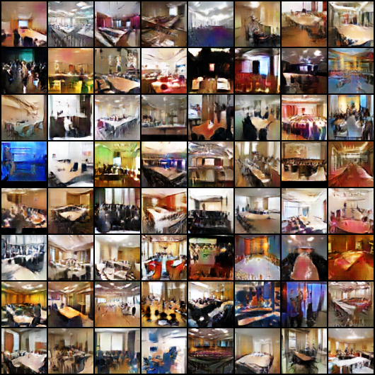

# WGAN-pytorch
pytorch implementations of [Wasserstein GAN](https://arxiv.org/abs/1701.07875) which improve the stability of learning by using approximated wasserstein distance and [Improved Training of Wasserstein GANs](https://arxiv.org/abs/1704.00028) which propose an alternative to clipping weights: penalize the norm of gradient of the critic with respect to its input..

## Result

LSUN - conference room

### Weight Cliipping

 |WGAN-weight clipping | WGAN-weight clipping with BatchNorm|                                   
 |:---: | :---:|                                       
 |||

 |WGAN-weight clipping | WGAN-weight clipping with BatchNorm|                                   
 |:---: | :---:|                                       
 |||

### Gradient Penalty

 |WGAN-gradient penalty | WGAN-gradient penalty with LayerNorm|                                   
 |:---: | :---:|                                       
 ||TBD|
 
 
  |WGAN-gradient penalty | WGAN-gradient penalty with LayerNorm|                                   
 |:---: | :---:|                                       
 ||TBD|